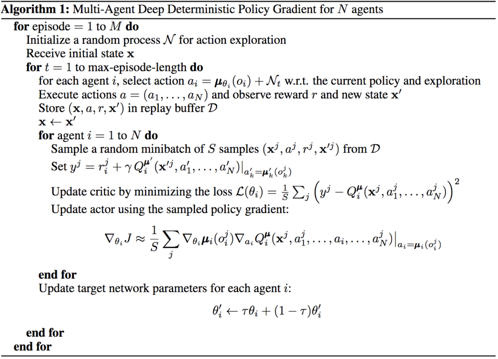
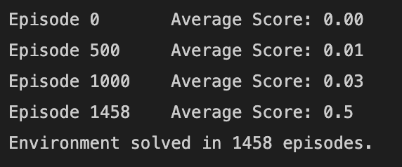
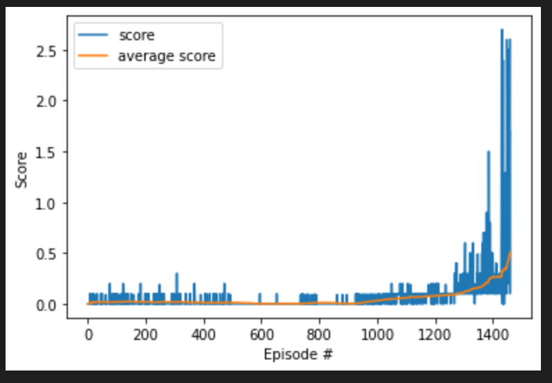

# Collaboration and Competition

## Introduction

Goal of this project is to train two agents to play tennis. We have used reinforcement learning method called Multi-Agent Deep Deterministic Policy Gradient(MADDPG). 

## Environment
In this environment, two agents control rackets to bounce a ball over a net. If an agent hits the ball over the net, it receives a reward of +0.1.  If an agent lets
a ball hit the ground or hits the ball out of bounds, it receives a reward of -0.01.  Thus, the goal of each agent is to keep the ball in play.

The observation space consists of 8 variables corresponding to the position and velocity of the ball and racket. Each agent receives its own, local observation.  
Two continuous actions are available, corresponding to movement toward (or away from) the net, and jumping.

## Model Architecture

### Multi-Agent Deep Deterministic Policy Gradient(MADDPG)
MADDPG method is an Actor Critic method. DDPG rains each agent independently, whereas MADDPG trains actor and critic using every agents' actions and states.
We will use MADDPG agent to train multiple ddpg agent simultaneously

### Actor - Critic Agent

Actor-critic methods leverage the strengths of both policy-based and value-based methods.
Using a policy-based approach, the agent (actor) learns how to act by directly estimating the optimal policy and maximizing reward through gradient ascent. 
Meanwhile, employing a value-based approach, the agent (critic) learns how to estimate the value (i.e., the future cumulative reward) of different state-action 
pairs. Actor-critic methods combine these two approaches in order to accelerate the learning process. Actor-critic agents are also more stable than value-based 
agents, while requiring fewer training samples than policy-based agents.
Actor-Critic method is implemented in model.py file. This is further trained using in ddpg_agent.py.

## Algorithm

### MADDPG Agent

### Ornstein-Uhlenbeck process

Along with above implementation we have implmented Ornstein  Uhlenbeck to add noise to the result. The Ornstein-Uhlenbeck process adds a certain amount of noise to the action values at each timestep. This noise is correlated to previous noise, and therefore tends to stay in the same direction for longer durations without canceling itself out. This allows the arm to maintain velocity and explore the action space with more continuity.

Parameters in OU process:

- mu: long running mean
- theta: speed of mean revision
- sigma: the volatility parameter

## Hyperparameters

- LR_ACTOR = 1e-4         # learning rate of the actor 
- LR_CRITIC = 3e-4        # learning rate of the critic
- WEIGHT_DECAY = 0        # L2 weight decay

- NOISE_REDUCTION_RATE = 0.99
- EPISODES_BEFORE_TRAINING = 500
- NOISE_START=1.0
- NOISE_END=0.1

- BUFFER_SIZE = int(1e5)  # replay buffer size
- BATCH_SIZE = 256        # minibatch size
- UPDATE_FREQ = 1

- GAMMA = 0.99            # discount factor
- TAU = 1e-3              # for soft update of target parameters

## Implementation

### model.py

Actor Critic model is implemented here.

Structure of models:

1. Input layer whose size is taken from state_size
2. Two hidden layers with 300 and 400 cells
3. Hidden layer one is Batch Normalized
4. Output layer whose side depends on the action size

### maddpg.py

MADDPG, ReplayBuffer are implemented here

MADDPG():

- This is a MADDPG agent
- init: state_size and action_size are defined. Adam Optimizer and QNetwork model are initialized. ReplayBuffer will be used to store the states, actions and 
rewards. Multiple Agents are initialized here
- reset: All the DDPG agents are reset in this method
- act: best action is chosen and returned 
- step:  Memory is added in the ReplayBuffer. A random sample is taken from ReplayBuffer memory. Method learn is called to improve the model. A sample memory 
fetched and this experience will be used train all the DDPG agent.
- learn: The entire MADDPG agent is trained in this method using experiences and agent(DDPG)
- save: save the checkpoint

ReplayBuffer;

- init: variables are initialized
- add: experience are appended in memory
- sample: a rando sample of action, reward, states are returned
- len: length of memory is returned

### ddpg_agent.py

DDPG agent is implemented here

Agent(DDPPG):

- init: state_size and action_size are defined. Adam Optimizer and QNetwork model are initialized. OUnoice is initialized here
- act: best action is chosen and returned 
- add_noise2: OUNoise is added using this method
- reset: OUNoise noise is reset here (internal noise is set to mu=0)
- learn: experience, targets, loss(mean squared error) and optimizer is used to update the weights for neural. Actor, Critic agents updated in this method

OUNoise:

- init: mu, sigma and theta are initialized here
- reset: Reset the internal state (= noise) to mean (mu).
- sample: Update internal state and return it as a noise sample.

## Result

### Model Training

### Plot of rewards

## Ideas for future work

1. Prioritized Experience Replay

Deep Q-Learning samples experience transitions uniformly from a replay memory. Prioritized experienced replay is based on the idea that the agent can learn more 
effectively from some transitions than from others, and the more important transitions should be sampled with higher probability.

2. Tuning hyperparameters in Agent class and MADDPG agent.

3. Dueling DQN

Currently, in order to determine which states are (or are not) valuable, we have to estimate the corresponding action values for each action. However, by replacing 
the traditional Deep Q-Network (DQN) architecture with a dueling architecture, we can assess the value of each state, without having to learn the effect of each 
action.

## References

Deep Reinforcement Learning Udacity Nanodegree
